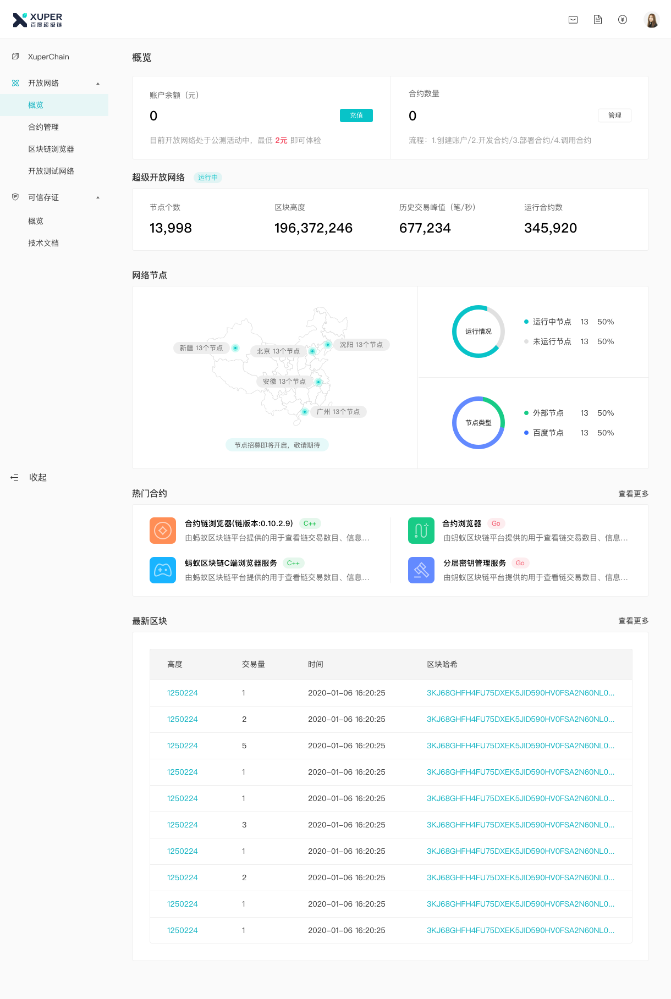
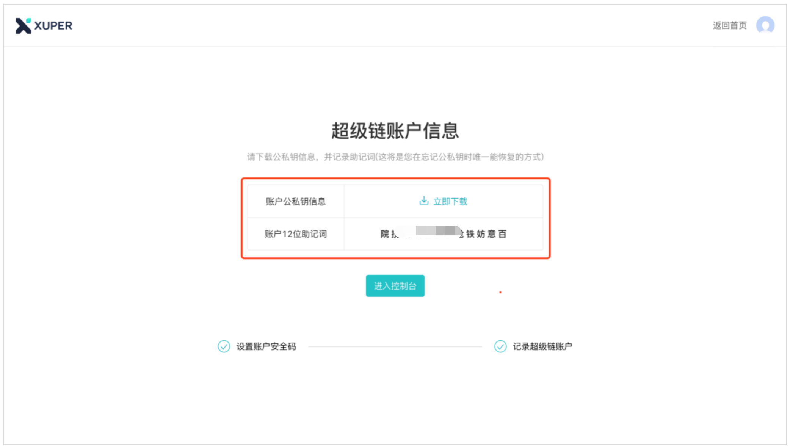
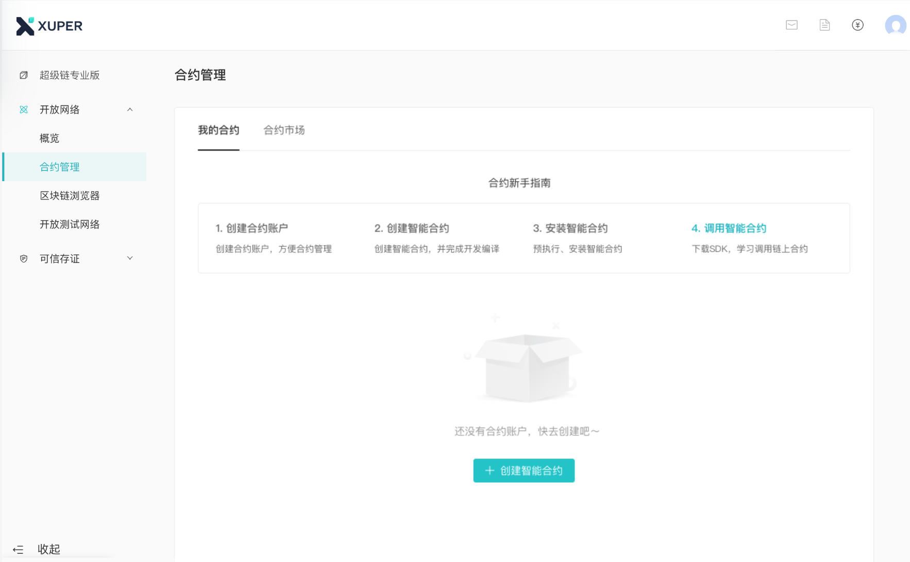
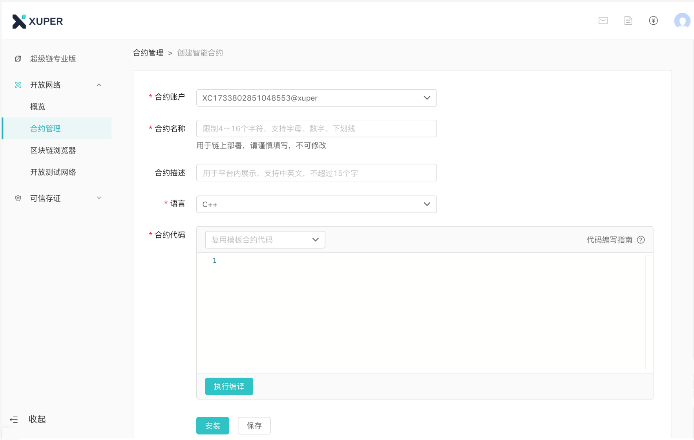
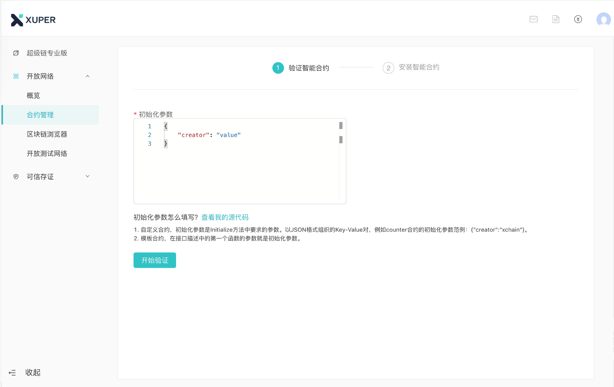

--- 
sidebar_label: 'xuperos'
slug: /xuperos/xuperos 
sidebar_position: 4
---
 
 
# 开放网络介绍

## 1.1XuperChain
 - 开放网络是基于百度自研底层技术搭建的区块链基础服务网络，符合中国标准，超级节点遍布全国，区块链网络完全开放，为用户提供区块链快速部署和运行的环境，最低2元钱就用上的区块链服务，让信任链接更加便利。

 - XuperChain 开放网络为开发者提供了合约开发、编译、部署、管理的一站式可视化集成环境，下面介绍如何在开放网络上开发部署智能合约。

### 1.1.1 账户注册

-  在 XuperChain 官网 <https://xchain.baidu.com/>  使用百度账号登录，如果没有百度账号请先注册。
-  进入 XuperChain  开放网络控制台，第一次登录的用户，平台会为用户创建区块链账户，请按照创建账户指引文档完成安全码设置，并记录自己的助记词和私钥。

### 1.1.2 创建合约账户

 1.  在工作台，选择「开放网络 ---\> 合约管理」，点击「创建合约账户」
 2.  进入创建合约账户页，输入安全码后点击「确认创建」，系统自动生成账户名称后，即创建完毕

### 1.1.3 合约开发和部署

 1. 在工作台，选择「开放网络 ---\> 合约管理」，点击「创建智能合约」
 2.  进入新页面，按要求填写基本信息、编辑合约代码，编译成功后点击「安装」，即可进入合约安装(部署)流程。
 3.  合约代码编译有两种方式：
     -   模板合约；选择模板后，只需在模板代码中填写相关参数即可（参考模板详情完成参数填写）
     -   自定义合约；在编辑器内完成C++语言的合约编辑即可

3.  进入安装流程，用户需按合约代码完成预执行操作。点击「开始验证」，执行通过会进入安装确认页

     -   模板合约；系统会提供模板的函数，只需填写参数即可（可参考模板详情）
     -   自定义合约；根据页面操作说明，完成函数、参数填写

4.  进入确认安装页，页面显示安装合约预计消耗的余额。点击「安装合约」将合约上链，上链过程需要等待10S左右。安装完成后，在合约管理列表中可看到合约状态变更为'安装成功'，即该合约已完成安装。

### 1.1.4 合约调用

开放网络上的部署的合约，除了可以在页面上调用还支持使用 SDK
调用。目前开放网络支持通过Go和Javascript、Java SDK调用智能合约，建议使用
Go SDK 或者 JavaScript SDK，Java SDK 目前功能较少。

 -   Go SDK：https://github.com/xuperchain/xuper-sdk-go
 -   Javascript SDK：https://github.com/xuperchain/xuper-sdk-js
 -   Java SDK：https://github.com/xuperchain/xuper-java-sdk

接下来我们会介绍如何使用 SDK 连接开放网络
